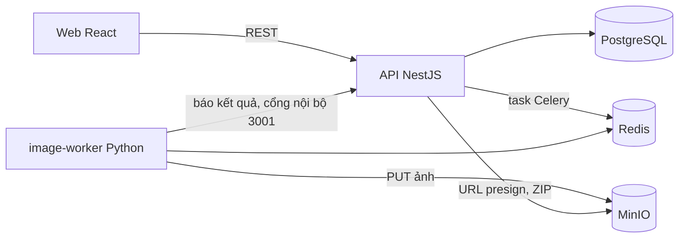

# ComicSystem — Hệ thống tạo truyện tranh bằng AI

Ứng dụng web để làm truyện tranh với ảnh do AI vẽ. Người dùng tạo comic, khai báo nhân vật, chia truyện thành cảnh và panel. Hệ thống sinh ảnh từng panel bằng Stable Diffusion XL trên một worker riêng, nên người dùng không phải đứng chờ. Xong thì xuất toàn bộ thành file ZIP.

Đây là dự án portfolio về kỹ thuật full-stack và xử lý AI bất đồng bộ, không phải dự án nghiên cứu model.

## Tính năng

- Đăng ký, đăng nhập. Mỗi người chỉ thấy comic của mình.
- Comic, story, nhân vật kèm ảnh tham chiếu, cảnh, panel, lời thoại.
- Sinh ảnh một panel hoặc cả loạt. Ảnh cũ giữ nguyên cho đến khi ảnh mới xong.
- Theo dõi tiến độ, hủy job, retry panel lỗi, đổi thứ tự panel.
- Batch nhiều panel: nếu chỉ một phần thành công, batch kết thúc là "xong, có panel lỗi" và vẫn giữ ảnh đã có.
- Xuất ZIP theo đúng thứ tự cảnh và panel.

## Kiến trúc



| Thành phần | Công nghệ | Việc |
|------------|-----------|------|
| `apps/web` | React, Vite, TypeScript | Giao diện |
| `apps/api` | NestJS, Prisma | Auth, dữ liệu, điền prompt, workflow batch, đưa job vào hàng đợi, export |
| `apps/image-worker` | Python, Celery, Diffusers | Sinh ảnh (mock hoặc SDXL), upload, báo kết quả |
| PostgreSQL | | Nguồn sự thật cho comic, job, workflow |
| Redis | | Chỉ làm broker cho Celery |
| MinIO | | Lưu ảnh và ZIP |

API không bao giờ tự chạy SDXL. Worker không ghi vào database: nó báo kết quả qua route nội bộ của API, và route này chỉ mở trong mạng Docker.

## Chạy nhanh

Cần [Docker](https://docs.docker.com/get-docker/) có Compose v2 và Node.js 20 trở lên. Node chỉ dùng để tạo file `.env`. Không cần GPU: mặc định chạy với worker giả lập, vẽ ảnh một màu thay cho SDXL.

```bash
git clone https://github.com/imxyanua/ai-comic-system.git
cd ai-comic-system
node scripts/init-env.mjs
docker compose up --build
```

Sau khi các container chạy xong:

| Địa chỉ | Là gì |
|---------|-------|
| http://localhost:5173 | Giao diện web |
| http://localhost:3000/health | API |
| http://localhost:9001 | Console MinIO (tài khoản trong `.env`) |

Trên web: đăng ký, tạo comic, thêm cảnh và panel, rồi bấm **Sinh ảnh**.

Dừng bằng `docker compose down`. Thêm `-v` để xoá luôn dữ liệu.

### Không có Node

Sao chép `.env.example` thành `.env`, rồi điền bốn secret `POSTGRES_PASSWORD`, `MINIO_ROOT_PASSWORD`, `JWT_SECRET`, `INTERNAL_SERVICE_TOKEN`, mỗi cái một chuỗi ngẫu nhiên ít nhất 32 ký tự:

```bash
openssl rand -hex 32
```

```powershell
-join ((1..32) | ForEach-Object { '{0:x2}' -f (Get-Random -Maximum 256) })
```

Chỉ dùng chữ và số. Mật khẩu Postgres nằm trong URL kết nối, nên ký tự đặc biệt sẽ làm hỏng URL.

### Nâng cấp từ bản cũ

Bản cũ dùng mật khẩu mặc định. Tạo `.env` như trên, rồi chạy `docker compose down -v` trước khi `up`, vì volume Postgres cũ đã khởi tạo bằng mật khẩu cũ.

## Chạy với GPU (SDXL thật)

Cần GPU NVIDIA và [NVIDIA Container Toolkit](https://docs.nvidia.com/datacenter/cloud-native/container-toolkit/latest/install-guide.html).

```bash
docker compose -f docker-compose.yml -f infra/docker/docker-compose.gpu.yml --profile gpu up --build
```

Lệnh này tắt worker giả lập và bật worker dùng `stabilityai/stable-diffusion-xl-base-1.0` ở float16. Lần đầu sẽ tải model vài GB vào volume `model-cache`. Mỗi GPU chạy một job một lúc. Nếu hết bộ nhớ GPU, job báo `INFERENCE_OOM`; giảm kích thước ảnh hoặc số bước rồi thử lại.

## Cấu hình

Docker Compose đọc `.env` ở thư mục gốc.

| Biến | Mặc định | Ý nghĩa |
|------|----------|---------|
| `POSTGRES_PASSWORD`, `MINIO_ROOT_PASSWORD`, `JWT_SECRET`, `INTERNAL_SERVICE_TOKEN` | không có, bắt buộc | Secret. API từ chối khởi động nếu secret ngắn hơn 32 ký tự |
| `MINIO_ROOT_USER` | `comic-minio` | Tài khoản MinIO |
| `JWT_TTL_SECONDS` | `43200` | Thời gian sống của phiên đăng nhập |
| `PUBLIC_API_URL` | `http://localhost:3000` | Địa chỉ trình duyệt gọi API. Được gắn vào bản build của web |
| `MINIO_PUBLIC_ENDPOINT` | `http://localhost:9000` | Địa chỉ trình duyệt tải ảnh |
| `WEB_ORIGIN` | `http://localhost:5173` | Origin được phép gọi API (CORS) |
| `BIND_ADDRESS` | `127.0.0.1` | Giao diện mạng mà web, API, MinIO mở cổng |

Muốn người khác trong mạng truy cập: đặt `BIND_ADDRESS=0.0.0.0` và đổi ba địa chỉ public thành IP hoặc tên miền của máy, rồi build lại web.

## Bảo mật

- Không có secret mặc định. Compose dừng nếu `.env` thiếu secret. `.env` nằm trong `.gitignore`.
- Mật khẩu băm bằng bcrypt. JWT chỉ nhận `HS256`.
- Quá 10 lần đăng nhập trong 15 phút cho một email từ một IP, hoặc quá 20 lần đăng ký trong một giờ từ một IP, thì bị chặn tạm (`429`).
- Route nội bộ của worker (`/internal/v1`) chỉ trả lời trên cổng `3001` trong mạng Docker, và cần `X-Service-Token`.
- Postgres, Redis và console MinIO chỉ mở trên `127.0.0.1`.
- Bucket MinIO không công khai. Ảnh tải qua URL presign hết hạn sau 15 phút. Upload ảnh tham chiếu chỉ nhận PNG, JPEG, WebP, tối đa 5 MB; kích thước và định dạng nằm trong chữ ký URL.
- Mọi truy vấn dữ liệu lọc theo chủ sở hữu. Id không thuộc user trả `404`.

Chưa có: refresh token, quên mật khẩu, HTTPS. Muốn đưa ra ngoài internet thì cần đặt reverse proxy có TLS phía trước.

## Phát triển

```bash
pnpm install
pnpm --filter api test        # Jest
pnpm --filter api build
pnpm --filter web build       # typecheck và build
cd apps/image-worker && pip install -r requirements.txt && python -m pytest
```

Với stack đang chạy (`docker compose up`):

```bash
node infra/docker/smoke-test.mjs                  # gọi API thật, đi hết các tính năng
pnpm --filter web exec playwright install chromium
pnpm --filter web exec playwright test            # bấm thật trên trình duyệt
```

Worker giả lập có hai marker trong prompt để thử tình huống: `[mock:fail]` cho job lỗi, `[mock:slow]` cho job chạy 6 giây.

## Cấu trúc

```text
apps/
  api/            NestJS, Prisma schema và migration
  web/            React, test Playwright trong e2e/
  image-worker/   Celery, mock và SDXL, Dockerfile.gpu
infra/docker/     override GPU, nginx, smoke test
scripts/          init-env.mjs
docker-compose.yml
```

## CI/CD

- **CI** (mọi PR và `main`): test và build từng app; dựng cả stack bằng Docker Compose; chạy smoke test API và test giao diện Playwright.
- **GPU worker** (khi worker đổi): build image GPU, chạy SDXL thật trên CPU với một model tí hon để kiểm đường Diffusers.
- **CD** (sau khi CI trên `main` qua): đẩy image `api`, `web`, `image-worker` lên GitHub Container Registry. Image web build với `http://localhost:3000`.

## Giới hạn

- Ảnh tham chiếu nhân vật mới được lưu, chưa đưa vào model, nên mặt nhân vật có thể khác nhau giữa các panel.
- Thoại chỉ hiển thị trên giao diện, không in lên ảnh và không có trong ZIP.
- Không có LLM sinh story hay prompt. Prompt trống được ghép từ style guide, mô tả nhân vật và tóm tắt cảnh.
- Nếu worker chết giữa chừng, job có thể kẹt ở trạng thái đang chạy.

## Giấy phép

[MIT](LICENSE)
